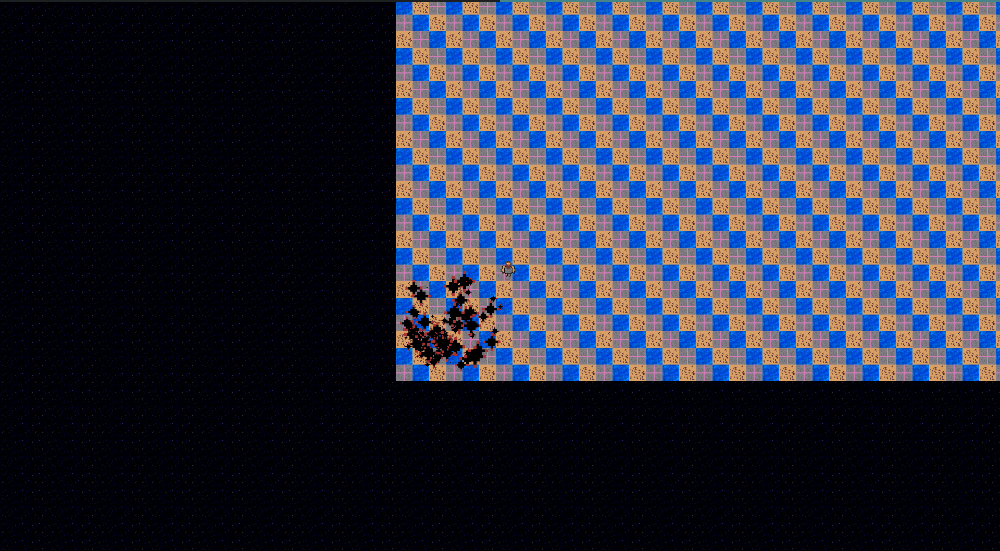
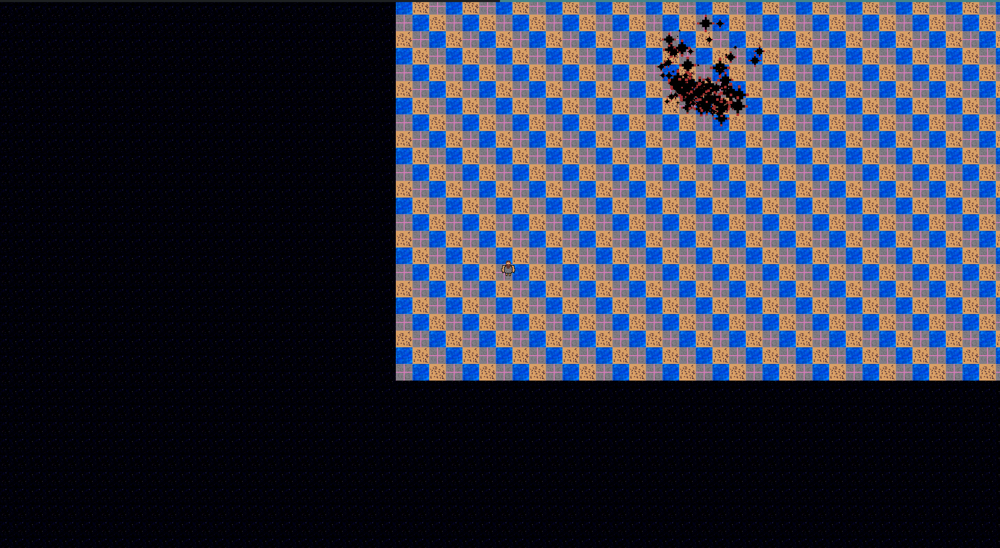

Надеюсь тут когда-нибудь появится игра :)

### UML

[Ссылка на все версии uml на google drive](https://drive.google.com/drive/folders/1pdQsPuEtVRGI4WKmFdC9H_WqyKwh_zpN?usp=sharing)

### Модель игры
Описание игры: Клетчатое поле, в некоторых клетках руды, руды добываем с помощью буров, транспортируем конвеерами на базу, строим пушки/стены для защиты, от монстров, которые разбиты на группы.

### Демонстрация




#### Видео

[youtube](https://www.youtube.com/watch?v=G19pYhj_K_I)

### Сборка
```
mkdir build
cd build
cmake ..
make
```
Для запуска
```
./game
```

